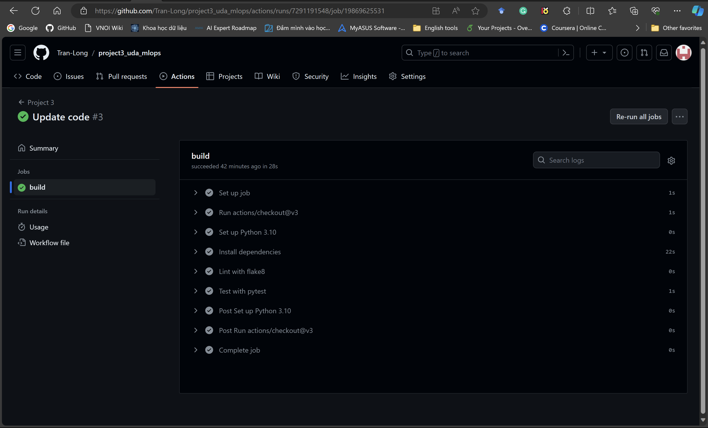
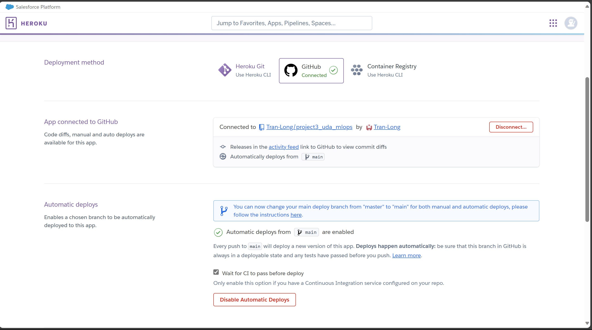
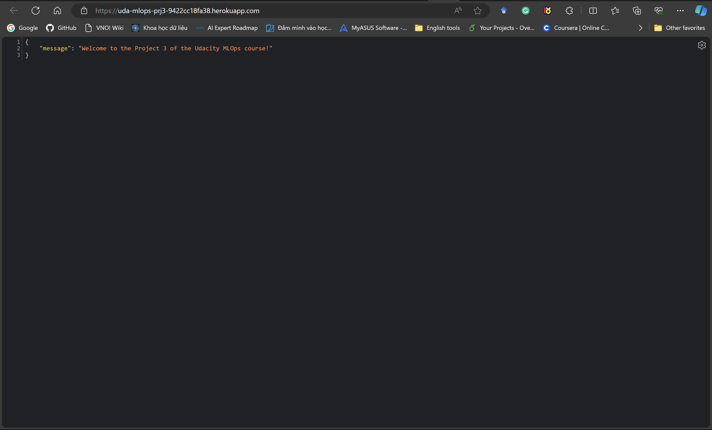
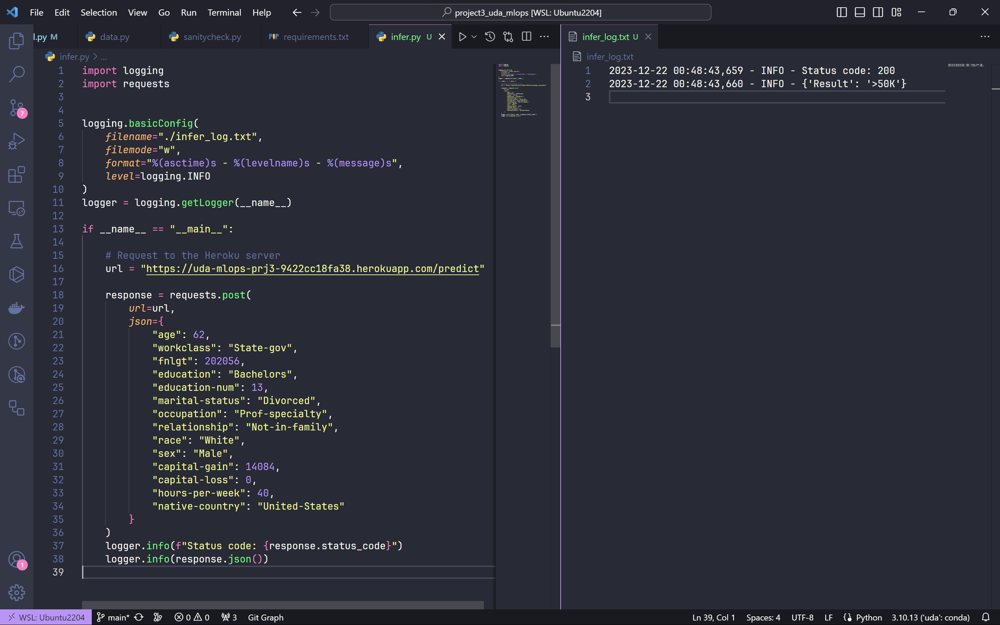

# Build an ML Pipeline for Short-term Rental Prices in NYC

[**Project Description**](#project-description) | [**Install**](#install) | [**Data**](#data) | [**Train model**](#train-model) | [**Run sanity checks**](#run-sanity-checks) | [**Run tests**](#run-tests) | [**CI/CD**](#cicd) | [**Live requests to Heroku server**](#Live-requests-to-Heroku-server) | [**Model Card**](#model-card) | [**Code Quality**](#code-quality)

## Project Description
Apply the skills acquired in this course to develop a classification model on publicly available Census Bureau data and deploy trained model using the FastAPI package and create API tests. The slice validation and the API tests will be incorporated into a CI/CD framework using GitHub Actions.

Source code: [Tran-Long/deploy_ml_pipeline_in_production](https://github.com/Tran-Long/project3_uda_mlops)

**Working directory tree**

```bash
.
├── INSTRUCTIONS.md
├── Procfile
├── README.md
├── config.yaml
├── data
│   └── census.csv
├── infer.py
├── logs
│   ├── infer_log.txt
│   └── train_log.txt
├── main.py
├── ml
│   ├── __init__.py
│   ├── data.py
│   └── model.py
├── model
│   └── dt.pkl
├── model_card.md
├── requirements.txt
├── results
│   └── slice_output.txt
├── sanitycheck.py
├── screenshots
│   ├── continuous_deployment.png
│   ├── continuous_integration.png
│   ├── example.png
│   ├── live_get.png
│   └── live_post.png
├── setup.py
├── tests
│   ├── test_apis.py
│   └── test_model.py
└── train_model.py

7 directories, 26 files
```
| # | Feature               | Stack             |
|:-:|-----------------------|:-----------------:|
| 0 | Language              | Python            |
| 1 | Clean code principles | Autopep8, Pylint  |
| 2 | Testing               | Pytest            |
| 3 | Logging               | Logging           |
| 4 | Development API       | FastAPI           |
| 5 | Cloud computing       | Heroku            |
| 6 | CI/CD                 | Github Actions    |


## Install
```bash
pip install -r requirements.txt
```

## Data
### 1. Download data
```bash
data/census.csv
```
Link: https://archive.ics.uci.edu/ml/datasets/census+income

The data has been cleaned up with VSCode editor (removing spaces)

## Train model
```bash
python train.py
```
Result *"./logs/train_log.txt"*
```
2023-12-22 00:50:55,801 - INFO - Loading data from data/census.csv
2023-12-22 00:50:55,855 - INFO - Splitting data into train/test with test ration: 0.2
2023-12-22 00:50:55,941 - INFO - Training decision tree model...
2023-12-22 00:50:56,095 - INFO - Training decision tree model DONE
2023-12-22 00:50:56,095 - INFO - Save [encoder, lb, dt_model] to ./model/dt.pkl
2023-12-22 00:50:56,108 - INFO - Inferencing model...
2023-12-22 00:50:56,117 - INFO - >>>Precision: 0.7199055861526357
2023-12-22 00:50:56,117 - INFO - >>>Recall: 0.5783817951959545
2023-12-22 00:50:56,117 - INFO - >>>Fbeta: 0.6414300736067297
2023-12-22 00:50:56,117 - INFO - Calculating metrics on slices of categorical features in data
2023-12-22 00:50:56,632 - INFO - Storing cat-slices results to ./results/slice_output.txt

```

## Run sanity checks
```bash
python sanity_checks.py
```
Result
```
============= Sanity Check Report ===========
Your test cases look good!
This is a heuristic based sanity testing and cannot guarantee the correctness of your code.
You should still check your work against the rubric to ensure you meet the criteria.
```

## Run tests
```bash
pytest tests/
```
Result
```
===================================================== test session starts ======================================================
platform linux -- Python 3.10.13, pytest-7.4.3, pluggy-1.3.0
rootdir: /home/parzival/Projects/project3_uda_mlops
plugins: anyio-3.7.1
collected 8 items                                                                                                              

tests/test_apis.py ....                                                                                                  [ 50%]
tests/test_model.py ....                                                                                                 [100%]

====================================================== 8 passed in 1.23s =======================================================
```

## CI/CD
### 1. CI with Github Actions


### 2. CD with Heroku



## Live requests to Heroku server



Script to request API method POST on predictions
```bash
python infer.py
```



## Model Card
Details in **./model_card.md**

## Code Quality
Style Guide - Refactored code using PEP 8 – Style Guide. 
```bash
autopep8 --in-place --aggressive --aggressive .
```

Docstring - All functions and files should have document strings that correctly identifies the inputs, outputs, and purpose of the function. All files have a document string that identifies the purpose of the file, the author, and the date the file was created.
