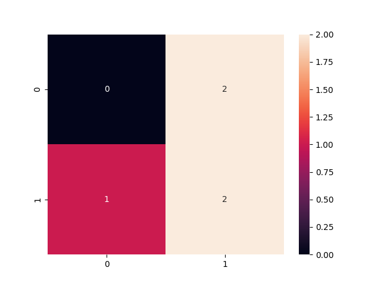

# Project: A Dynamic Risk Assessment System

[**Project Description**](#project-description) | [**Installation**](#installation) | [**Workspace**](#workspace) | [**Step-by-steps**](#step-by-steps) | [**Code Quality**](#code-quality)

## Project Description
The company needs you to create, deploy, and monitor a risk assessment ML model that will estimate the attrition risk of each of the company's 10,000 clients. If the model you create and deploy is accurate, it will enable the client managers to contact the clients with the highest risk and avoid losing clients and revenue.

Creating and deploying the model isn't the end of your work, though. Your industry is dynamic and constantly changing, and a model that was created a year or a month ago might not still be accurate today. Because of this, you need to set up regular monitoring of your model to ensure that it remains accurate and up-to-date. You'll set up processes and scripts to re-train, re-deploy, monitor, and report on your ML model, so that your company can get risk assessments that are as accurate as possible and minimize client attrition.

Source code: [vnk8071/ml_model_scoring_and_monitoring](https://github.com/vnk8071/machine-learning-in-production/tree/main/projects/ml_model_scoring_and_monitoring)

```bash
tree . -I '__pycache__'
.
├── README.md
├── apicalls.py
├── app.py
├── config.json
├── config_prod.json
├── cronjob.txt
├── deployment.py
├── diagnostics.py
├── fullprocess.py
├── ingesteddata
│   ├── finaldata.csv
│   └── ingestedfiles.txt
├── ingestion.py
├── models
│   ├── apireturns2.txt
│   ├── confusionmatrix2.png
│   ├── latestscore.txt
│   └── trainedmodel.pkl
├── practicedata
│   ├── dataset1.csv
│   └── dataset2.csv
├── practicemodels
│   ├── apireturns.txt
│   ├── confusionmatrix.png
│   ├── latestscore.txt
│   └── trainedmodel.pkl
├── production_deployment
│   ├── ingestedfiles.txt
│   ├── latestscore.txt
│   └── trainedmodel.pkl
├── reporting.py
├── requirements.txt
├── scoring.py
├── sourcedata
│   ├── dataset3.csv
│   └── dataset4.csv
├── testdata
│   └── testdata.csv
├── training.py
├── utils.py
└── wsgi.py
```

| # | Feature               | Stack             |
|:-:|-----------------------|:-----------------:|
| 0 | Language              | Python            |
| 1 | Clean code principles | Autopep8          |
| 2 | Logging               | Logging           |
| 3 | Auto trigger          | Cronjob           |

## Installation
```bash
pip install -r requirements.txt
```


## Step-by-steps
### Step 1: Data Ingestion
```bash
python ingestion.py
```

### Step 2: Training, scoring, and deploying
```bash
python training.py
python scoring.py
python deployment.py
```

### Step 3: Diagnostics
```bash
python diagnostics.py
```

### Step 4: Reporting
```bash
python reporting.py
```



### Step 5: API Setup and Request
```bash
python app.py
python apicalls.py
```
Access ML diagnostics and results. There are four endpoints: one for model predictions, one for model scoring, one for summary statistics, and one for other diagnostics.

### Step 6: Full Process
Make cronjob to run full process every 10 minutes
```bash
crontab -e
*/10 * * * * /home/parzival/Projects/starter-file/cronjob.txt
```

```bash
python fullprocess.py
```

## Code Quality
Style Guide - Refactored code using PEP 8 – Style Guide. 
```bash
autopep8 --in-place --aggressive --aggressive ./*.py
```

Docstring - All functions and files should have document strings that correctly identifies the inputs, outputs, and purpose of the function. All files have a document string that identifies the purpose of the file, the author, and the date the file was created.
